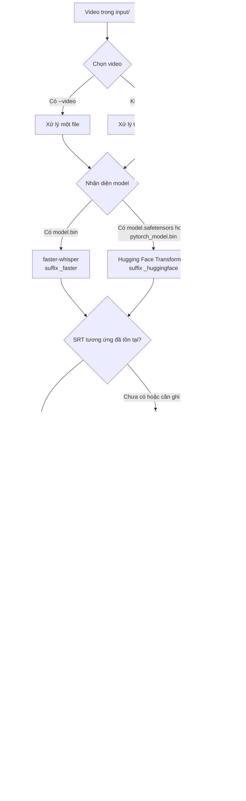
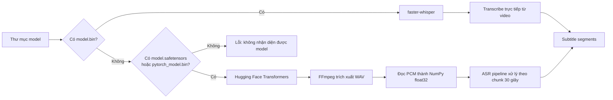

<div align="center">

# Transcript Video

**Chuyển giọng nói trong video thành phụ đề, xuất file SRT và burn hard subtitle vào video bằng Whisper.**


</div>

## Mục lục

- [Tổng quan](#tổng-quan)
- [Luồng xử lý](#luồng-xử-lý)
- [Cấu trúc thư mục](#cấu-trúc-thư-mục)
- [Yêu cầu môi trường](#yêu-cầu-môi-trường)
- [Cài đặt](#cài-đặt)
- [Chuẩn bị model](#chuẩn-bị-model)
- [Sử dụng nhanh](#sử-dụng-nhanh)
- [Tham số CLI](#tham-số-cli)
- [Cách hai engine hoạt động](#cách-hai-engine-hoạt-động)
- [Output](#output)
- [Lưu ý vận hành](#lưu-ý-vận-hành)
- [Xử lý lỗi thường gặp](#xử-lý-lỗi-thường-gặp)

## Tổng quan

Project cung cấp một pipeline Python chạy local để xử lý video theo batch:

1. Đọc một video cụ thể hoặc toàn bộ video trong `input/`.
2. Tự nhận diện định dạng model Whisper.
3. Chuyển giọng nói thành phụ đề nguyên ngữ hoặc dịch sang tiếng Anh.
4. Ghi phụ đề ra file `.srt` trong `subtitles/`.
5. Burn phụ đề vào video và ghi kết quả vào `output/`.

Pipeline hỗ trợ hai loại model local:

| Engine | File dùng để nhận diện | Đặc điểm |
| --- | --- | --- |
| `faster-whisper` | `model.bin` | Nhẹ hơn, phù hợp để xử lý nhanh với CTranslate2 |
| Hugging Face Transformers | `model.safetensors` hoặc `pytorch_model.bin` | Dùng model Whisper chuẩn từ Hugging Face |

## Luồng xử lý



## Cấu trúc thư mục

```text
transcript-video/
├── input/                  # Video đầu vào
├── model/                  # Model local, không commit lên Git
│   ├── faster-whisper-large-v3/
│   └── whisper-large-v3/
├── output/                 # Video đã burn hard subtitle
├── subtitles/              # File SRT được tạo ra hoặc chỉnh sửa thủ công
├── temp/                   # Audio WAV tạm thời khi chạy Hugging Face engine
├── requirements.txt
└── transcript_video.py
```

Các định dạng video được hỗ trợ: `.mp4`, `.mkv`, `.mov`, `.avi`, `.webm`, `.m4v`.

Ví dụ tên artifact sau khi xử lý:

```text
input/crawl guide.mp4
subtitles/crawl guide_faster.srt
output/crawl guide_ENG_SUB.mp4
```

## Yêu cầu môi trường

- Windows với PowerShell.
- Python `3.12` (môi trường hiện tại sử dụng Python `3.12.10`).
- Model Whisper đã tải về máy.
- GPU NVIDIA và CUDA được khuyến nghị khi xử lý video dài.

Không cần cài FFmpeg thủ công: project sử dụng executable do `imageio-ffmpeg` cung cấp.

## Cài đặt

Tạo virtual environment:

```powershell
python -m venv .venv
.\.venv\Scripts\Activate.ps1
python -m pip install --upgrade pip
```

Cài dependency theo môi trường CUDA 12.1 đang được khai báo trong `requirements.txt`:

```powershell
python -m pip install -r requirements.txt --extra-index-url https://download.pytorch.org/whl/cu121
```

Nếu chỉ sử dụng CPU, hãy cài bản PyTorch phù hợp với CPU trước, sau đó chạy script với `--device cpu`. File `requirements.txt` hiện được pin theo môi trường GPU CUDA 12.1 của project.

## Chuẩn bị model

Đặt model local vào `model/`. Script nhận diện engine dựa trên file trong thư mục model:

```text
model/
├── faster-whisper-large-v3/
│   ├── config.json
│   ├── model.bin
│   ├── tokenizer.json
│   └── vocabulary.json
└── whisper-large-v3/
    ├── config.json
    ├── model.safetensors
    ├── preprocessor_config.json
    └── tokenizer.json
```

Model là artifact lớn và đã được ignore khỏi Git. Khi chạy, nên truyền `--model` rõ ràng vì giá trị mặc định trong script đang trỏ đến một đường dẫn local.

## Sử dụng nhanh

Đặt video vào `input/`, sau đó chạy model `faster-whisper`:

```powershell
.\.venv\Scripts\python.exe .\transcript_video.py `
  --model .\model\faster-whisper-large-v3
```

Mặc định script sẽ:

- Quét tất cả video hợp lệ trong `input/`.
- Dùng `--task translate` để tạo phụ đề tiếng Anh.
- Dùng gợi ý ngôn ngữ nguồn `vi`.
- Chạy inference trên `cuda`.
- Tạo `subtitles/<video-name>_<model>.srt`.
- Tạo `output/<video-name>_ENG_SUB.mp4`.

### Một số lệnh thường dùng

Chỉ xử lý một video:

```powershell
.\.venv\Scripts\python.exe .\transcript_video.py `
  --video "crawl guide.mp4" `
  --model .\model\faster-whisper-large-v3
```

Giữ nguyên ngôn ngữ gốc thay vì dịch sang tiếng Anh:

```powershell
.\.venv\Scripts\python.exe .\transcript_video.py `
  --task transcribe `
  --model .\model\faster-whisper-large-v3
```

Chỉ sinh file SRT, không burn subtitle:

```powershell
.\.venv\Scripts\python.exe .\transcript_video.py `
  --skip-burn `
  --model .\model\faster-whisper-large-v3
```

Tạo lại SRT kể cả khi file đã tồn tại:

```powershell
.\.venv\Scripts\python.exe .\transcript_video.py `
  --overwrite-srt `
  --model .\model\faster-whisper-large-v3
```

Chạy Hugging Face Transformers engine trên CPU:

```powershell
.\.venv\Scripts\python.exe .\transcript_video.py `
  --device cpu `
  --model .\model\whisper-large-v3
```

## Tham số CLI

| Tham số | Mặc định | Ý nghĩa |
| --- | --- | --- |
| `--root` | `.` | Thư mục gốc chứa `input/`, `subtitles/`, `output/`, `temp/` |
| `--video` | Trống | Chỉ xử lý một file cụ thể bên trong `input/` |
| `--model` | Đường dẫn local trong script | Thư mục chứa model `faster-whisper` hoặc Hugging Face Whisper |
| `--task` | `translate` | `translate`: dịch sang tiếng Anh; `transcribe`: giữ nguyên ngôn ngữ |
| `--language` | `vi` | Gợi ý ngôn ngữ nguồn cho `faster-whisper`; truyền chuỗi rỗng để auto-detect |
| `--device` | `cuda` | Thiết bị inference: `cuda` hoặc `cpu` |
| `--compute-type` | `int8` | Kiểu tính toán cho `faster-whisper`, thường dùng `int8`, `float16`, `float32` |
| `--overwrite-srt` | Tắt | Tạo lại SRT nếu file cùng tên đã tồn tại |
| `--skip-burn` | Tắt | Chỉ tạo SRT, không xuất video hard subtitle |

Xem trợ giúp trực tiếp:

```powershell
.\.venv\Scripts\python.exe .\transcript_video.py --help
```

## Cách hai engine hoạt động



Với Hugging Face engine, audio WAV mono `16 kHz` chỉ tồn tại tạm thời trong `temp/` và được xóa sau khi xử lý xong. Pipeline đọc WAV thành NumPy array trước khi đưa vào Transformers để tránh phụ thuộc vào cơ chế tìm FFmpeg nội bộ của thư viện.

## Output

Mỗi video có thể tạo ra hai artifact:

| Artifact | Đường dẫn | Nội dung |
| --- | --- | --- |
| Subtitle mềm | `subtitles/<video-name>_<model>.srt` | Phụ đề theo chuẩn SRT, có thể chỉnh sửa trước khi burn |
| Video hard subtitle | `output/<video-name>_ENG_SUB.mp4` | Video MP4 đã gắn phụ đề trực tiếp vào hình ảnh |

Ví dụ SRT:

```srt
1
00:00:00,000 --> 00:00:07,000
Hello everyone, today I will show you how to crawl the score data...
```

## Lưu ý vận hành

- SRT dùng suffix `_faster.srt` với `faster-whisper` và `_huggingface.srt` với Hugging Face Transformers.
- Nếu SRT tương ứng với model đã tồn tại, script sẽ tái sử dụng file đó. Dùng `--overwrite-srt` khi muốn chạy transcription lại với model hoặc tham số khác.
- File SRT theo quy tắc cũ như `crawl guide.srt` sẽ không tự được tái sử dụng. Đổi tên file sang suffix tương ứng nếu muốn burn lại mà không chạy transcription.
- Có thể chỉnh sửa thủ công file trong `subtitles/`, sau đó chạy lại không kèm `--overwrite-srt` để burn bản subtitle đã sửa.
- Tên video đầu ra luôn có suffix `_ENG_SUB.mp4`, kể cả khi chạy `--task transcribe`.
- `--language` hiện chỉ được truyền vào `faster-whisper`. Hugging Face engine sử dụng `task` nhưng không nhận language hint từ CLI.
- Hugging Face engine tự chuyển sang CPU nếu yêu cầu `cuda` nhưng PyTorch không tìm thấy CUDA. Với `faster-whisper`, hãy truyền đúng `--device` phù hợp với máy.
- Audio của video đầu ra được copy nguyên bản bằng FFmpeg (`-c:a copy`).
- Nếu một video lỗi trong chế độ batch, script ghi log lỗi và tiếp tục xử lý video kế tiếp.

## Xử lý lỗi thường gặp

| Lỗi | Nguyên nhân thường gặp | Cách xử lý |
| --- | --- | --- |
| `Không tìm thấy model folder` | Sai đường dẫn truyền vào `--model` | Kiểm tra thư mục model và dùng đường dẫn tương đối như `.\model\faster-whisper-large-v3` |
| `Không nhận diện được định dạng model` | Thiếu `model.bin`, `model.safetensors` hoặc `pytorch_model.bin` | Kiểm tra model đã tải đầy đủ |
| `Không có video nào trong folder` | `input/` trống hoặc extension không được hỗ trợ | Thêm video hợp lệ vào `input/` |
| Lỗi CUDA | Máy không có GPU NVIDIA hoặc CUDA/PyTorch không tương thích | Chạy với `--device cpu` hoặc cài lại PyTorch đúng phiên bản CUDA |
| Burn subtitle lỗi | File SRT không tồn tại hoặc FFmpeg không đọc được subtitle | Chạy tạo SRT trước, kiểm tra encoding UTF-8 và đường dẫn file |
